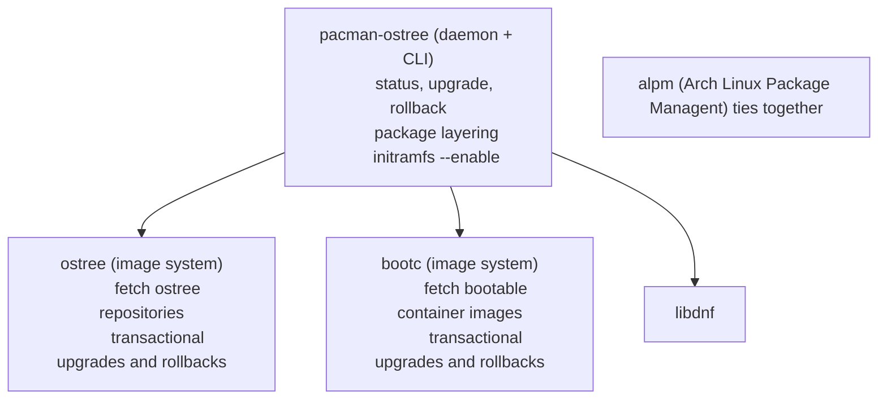

# pacman-ostree

    

# 
pacman-ostree is a Hybrid OSTree Image/Pacman Package installer ⚛️/📦 written in C, inspired by rpm-ostree

# Roadmap
- [X] Create github repo
- [ ] Add base function (commit, deploy)
- [ ] Add alpm package layering
- [ ] Add upgrade function
- [ ] Add Deamon (pacman-ostreed)
